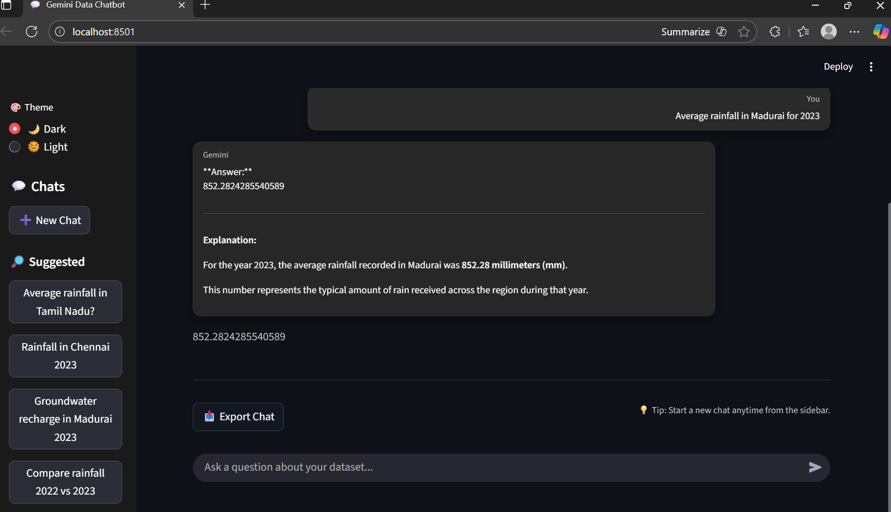

# 💧 Aqua — Intelligent Groundwater RAG Chatbot

An advanced **Retrieval-Augmented Generation (RAG) chatbot** designed to analyze groundwater and rainfall data using **semantic search, clustering insights, and LLM-powered reasoning**.

---

## 📌 Project Description

Aqua is a smart AI-driven assistant built to transform groundwater datasets into an **interactive conversational system**.

Unlike traditional dashboards, this chatbot allows users to **ask natural language questions (in English & Tamil)** and receive **accurate, data-backed insights**.

The system integrates structured data with modern AI techniques to answer queries related to:

* Rainfall patterns
* Groundwater usage
* District-wise analysis
* Cluster-based insights
* Year-wise comparisons

This makes Aqua a powerful tool for **data exploration, decision-making, and academic research**.

## 📸 Application Preview

### 🔹 Chatbot Interface

### 🔹 Data Comparison Dashboard

### 🔹 Tamil Query Support

---

## 🚀 Core Features

### 🔍 Intelligent Query Handling

* Understands natural language queries
* Supports both **English and Tamil**
* Handles vague and incomplete questions

### 🧠 RAG-Based Retrieval System

* Converts tabular data into meaningful text chunks
* Retrieves relevant information using vector similarity
* Ensures answers are grounded in actual data

### 📊 Advanced Data Insights

* District-wise and year-wise summaries
* Cluster-based aggregation analysis
* Rainfall rankings and comparisons
* Trend-based insights

### 🎯 Smart Retrieval Optimization

* Query-aware boosting mechanism
* Improves accuracy for:

  * Ranking queries (highest, lowest)
  * Year-based questions
  * Cluster-related queries

### 🧩 Fuzzy Matching System

* Handles spelling mistakes in district names
* Improves user experience and robustness

### 💬 Interactive Chat Interface

* Built with Streamlit
* Maintains conversational flow
* Displays retrieved context for transparency

---

## ⚙️ Workflow

Data Source (MongoDB / CSV)
⬇
Data Chunking & Transformation
⬇
Embedding Generation (Sentence Transformers)
⬇
Vector Similarity Search
⬇
Relevant Context Retrieval
⬇
LLM (Google Gemini) Response Generation
⬇
User-Friendly Answer

---

## 🧠 Technologies Used

* **Python** — Core development
* **Pandas & NumPy** — Data processing
* **MongoDB** — Data storage
* **Sentence Transformers** — Embeddings
* **Scikit-learn** — Similarity computation
* **Google Gemini API** — Response generation
* **Streamlit** — Interactive UI

---

## 💡 Example Queries

* “Which district recorded highest rainfall in 2024?”
* “Compare rainfall trends across years”
* “Which cluster has the highest average rainfall?”
* “சென்னை மாவட்டத்தில் மழை அளவு என்ன?”

---

## 🔬 Key Functionalities

### 📌 Data-to-Text Transformation

Transforms structured dataset into descriptive chunks for better retrieval.

### 📌 Semantic Search

Uses embeddings + cosine similarity for intelligent document retrieval.

### 📌 Context-Aware Answer Generation

Ensures responses are generated strictly from retrieved data.

### 📌 Conversational AI

Maintains chat history and provides human-like responses.

---

## 🎯 Target Users

* 🎓 Students — for academic analysis
* 📊 Data Analysts — for exploratory insights
* 🏫 Researchers — for groundwater studies
* 🌍 Policy Makers — for decision support

---

## 📌 Conclusion

Aqua demonstrates how modern AI techniques like RAG can convert raw datasets into **interactive, intelligent systems**, making data more accessible and meaningful to users.
